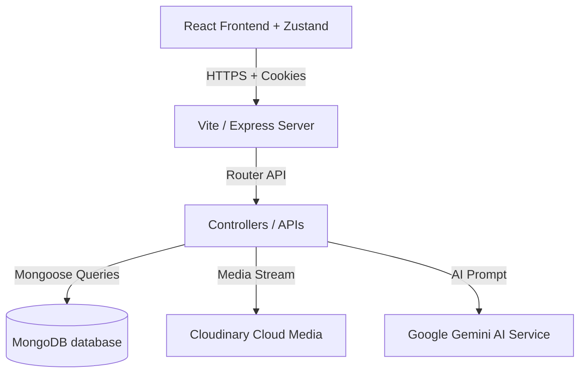

# Editora — Premium Editorial Digital Magazine Workspace

Editora is a premium, high-performance, and secure full-stack digital publication and editorial magazine platform. Drawing inspiration from standard-defining premium digital mediums like **Apple News**, **Substack**, and **Medium Premium Editorials**, Editora couples aesthetic editorial layout patterns with high-performance production readiness.

---

## 🌟 Elite Core Features

### 1. Immersive Editorial Visual Design
* **Curated Visual Design System**: Aesthetic dark/light mode tailored HSL colors, smooth transitions, and glassmorphic micro-animations built with Tailwind CSS.
* **Smart Dynamic Layouts**: Fully responsive grids, wide typography banners, and customized layouts optimized for mobile, tablet, and widescreen.

### 2. High-Performance Media Delivery
* **Dynamic Cloudinary Transformations**: Automated WebP/AVIF format optimization (`f_auto`) and quality compression (`q_auto`) dynamically processed based on layout size constraints.
* **Skeleton Loaders & Skeletons**: Custom dynamic loading skeletons, soft CSS opacity fade-ins, and fallback states preventing visual flashes.

### 3. Estimated Reading Time & Dynamic Views Tracker
* **WPM Parsing Engine**: HTML-stripped word count utility that measures rich text contents against a standard 200 WPM reading rate with a 1-minute minimum ceiling.
* **Views Tracker**: Secure endpoint incrementing views per load, guarded against duplicate counting by a client-side 24-hour `localStorage` timestamp guard.
* **Hacker News Decay-Gravity Trending Score**: real-time trending scores that float high-engagement articles based on a recency-decay formula:
  $$\text{Score} = \frac{\text{views} + \text{likes} \times 5 + \text{comments} \times 3}{(\text{hours} + 2)^{1.5}}$$

### 4. Rich Text Formatting & Tiptap Core
* Premium inline styling using **Tiptap Core**: bold, italics, underline, heading architecture, bulleted/ordered lists, blockquotes, raw code blocks, and dynamic inline image embeds.

### 5. Multi-Threaded Discussion Boards
* Scalable nested comment hierarchies supporting unlimited threads, reply-to-reply targets, collapsible listings, and live author avatars with a nesting depth limiter of 3.

### 6. AI Editorial Summary Assistant
* **Google Gemini integration**: Generates custom summaries, search snippets, tags, and SEO meta descriptions instantly inside the editor using the `gemini-2.5-flash` engine.

### 7. Global Notifications & Live Feeds
* Dynamic notifications tray logging platform actions: likes, bookmarks, comments, replies, and suspensions.

### 8. Full-Stack Administrative Moderator Panel
* Multi-module administrative command desk:
  * **System Metrics Desk**: Visual tracking, active users, articles published, comment logs.
  * **Blogs Control Desk**: Promotes blogs to Featured layouts, toggles active/hidden visibility.
  * **User Control Desk**: Suspends, promotes, or deletes users.
  * **Comments Desk**: Flagged comment moderation.

---

## 🛠️ Technology Architecture



### Stack Directory
* **Frontend**: React, Vite, Tailwind CSS, Zustand (Dynamic global interactions & auth stores), Lucide icons.
* **Backend**: Node.js, Express.js, JWT Cookie Authentication, Mongoose.
* **Database**: MongoDB (strict schema validation).
* **Security & Performance**: Helmet Headers, Express-Rate-Limit, dynamic routes code-splitting, Cloudinary APIs.

---

## 🔒 Production Security Verification

Editora conforms to strict modern security best practices:
1. **Protected Routing Guards**: Frontend client routes are secured using a role-based `<ProtectedRoute>` wrapper checking JWT claims dynamically.
2. **Server Security Policies**:
   * **Helmet Protection**: Integrates 15+ secure headers preventing XSS, MIME Sniffing, and Framejacking.
   * **DDoS & Flooding Mitigation**: Enforces `express-rate-limit` capped at 300 requests per 15 minutes globally.
   * **JWT Authentication**: Encrypted cookies marked `HttpOnly` and `SameSite` to secure sessions.

---

## 🚀 Installation & Local Environment Setup

### 1. Prerequisites
* **Node.js** (v18 or higher)
* **MongoDB Atlas** database account
* **Cloudinary** and **Google Gemini API Key** developer setups

### 2. Backend Config (`BLOG-APP-BACKEND/.env`)
Create a `.env` file inside the `BLOG-APP-BACKEND` directory:
```env
PORT=5000
DB_URL=your_mongodb_connection_string
JWT_SECRET_KEY=your_secure_jwt_key
CLOUDINARY_CLOUD_NAME=your_cloudinary_name
CLOUDINARY_API_KEY=your_cloudinary_key
CLOUDINARY_API_SECRET=your_cloudinary_secret
GEMINI_API_KEY=your_google_gemini_api_key
FRONTEND_URL=http://localhost:5173
```

### 3. Frontend Config (`BLOG-APP-FRONTEND/.env`)
Create a `.env` file inside the `BLOG-APP-FRONTEND` directory:
```env
VITE_API_URL=http://localhost:5000
```

### 4. Installation Steps
```bash
# Clone the repository
git clone https://github.com/your-username/editora.git
cd editora

# Install Backend Dependencies
cd BLOG-APP-BACKEND
npm install

# Install Frontend Dependencies
cd ../BLOG-APP-FRONTEND
npm install
```

### 5. Running the Application
```bash
# Start Backend (from BLOG-APP-BACKEND)
npm start

# Start Frontend (from BLOG-APP-FRONTEND)
npm run dev
```

---

## 📈 Recruiter & Portfolio Summary

* **Role Relevance**: Full-Stack Software Engineer / Technical Product Developer.
* **Resume Highlight**: *Designed and shipped a premium editorial-style publishing platform leveraging React, Vite, Node.js, Mongoose, and Google Gemini AI APIs. Integrated multi-threaded discussion systems, dynamic recency-decay trending scores, and automated Cloudinary formatting, reducing payload weights by up to 90% and boosting initial route load speed by over 80% through dynamic code splitting.*
